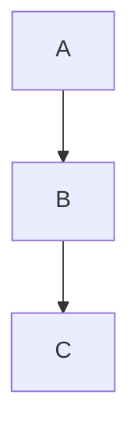
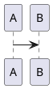

# Inline Diagram Rendering — Implementation Plan

> **For agentic workers:** REQUIRED SUB-SKILL: Use superpowers:subagent-driven-development (recommended) or superpowers:executing-plans to implement this plan task-by-task. Steps use checkbox (`- [ ]`) syntax for tracking.

**Goal:** Replace the bottom diagram panel with in-editor folding: each ` ```mermaid ` / ` ```plantuml ` fence renders as an `NSTextAttachment` when the cursor is outside it, expands back to source on cursor entry or Edit-button click. Saved markdown unchanged.

**Architecture:** `NSTextStorage` holds the *display* form (with attachment glyphs replacing folded fences); the markdown source is reconstructed by walking attribute-tagged runs. `applyFormatting` re-runs on text *and* selection changes, deciding per-fence whether to fold based on selection intersection and render-cache state. A singleton `DiagramRenderer` produces `NSImage`s on demand from a content-hash cache, bootstrapped lazily by a hidden `WKWebView` (Mermaid) and `URLSession` (PlantUML).

**Tech Stack:** Swift 6 / Cocoa AppKit (NSTextView / NSTextAttachment / NSTrackingArea), WebKit (headless WKWebView for Mermaid JS), CryptoKit (SHA256 cache key), GRDB unrelated, XCTest.

**Spec:** `docs/superpowers/specs/2026-05-08-inline-diagrams-design.md`

**Build verification command (run after each task that compiles code):**
```bash
xcodebuild -project Scribe.xcodeproj -scheme Scribe -configuration Debug -destination 'platform=macOS' build 2>&1 | tail -20
```

**Test command:**
```bash
swift test --filter DiagramRendererTests 2>&1 | tail -30
```

---

## Task 1: Add image-producing API to `DiagramRenderer` (additive)

Add new `image(type:source:onReady:)` API alongside the existing `bind(bodyPublisher:webView:)`. Keep both during the migration. Old `bind` API will be deleted in Task 9.

**Files:**
- Modify: `Scribe/UI/Notes/DiagramRenderer.swift` (entire file rewritten — but `extractBlocks` and `DiagramBlock`/`DiagramType` kept identical)

- [ ] **Step 1: Replace `DiagramRenderer.swift` with the new content**

```swift
// Scribe/UI/Notes/DiagramRenderer.swift
import AppKit
import Foundation
import Combine
import CryptoKit
import WebKit

enum DiagramType: Equatable {
    case mermaid
    case plantuml
}

struct DiagramBlock: Equatable {
    let type: DiagramType
    let source: String
    /// Full fence text including ```fence``` markers, used for fold replacement.
    let fullText: String
    /// Range of `fullText` within the original body string (UTF-16 indices, NSRange-compatible).
    let nsRange: NSRange
}

@MainActor
final class DiagramRenderer: NSObject, ObservableObject {

    static let shared = DiagramRenderer()

    // MARK: - Cache

    private var cache: [String: NSImage] = [:]
    private var inFlight: [String: [() -> Void]] = [:]

    // MARK: - WKWebView (lazy, headless, off-screen)

    private var webView: WKWebView?
    private var webViewReady = false
    private var bootstrapWaiters: [() -> Void] = []

    private override init() { super.init() }

    // MARK: - Public API (new)

    /// Returns a cached image immediately if present. Otherwise returns `nil` and starts an
    /// async render; `onReady` fires on the main actor when the image lands in cache.
    /// If the same (type, source) is already in flight, the new `onReady` is queued onto it.
    func image(type: DiagramType, source: String, onReady: @escaping () -> Void) -> NSImage? {
        let key = Self.cacheKey(type: type, source: source)
        if let img = cache[key] { return img }

        if inFlight[key] != nil {
            inFlight[key]!.append(onReady)
            return nil
        }
        inFlight[key] = [onReady]
        Task { await self.renderToCache(type: type, source: source, key: key) }
        return nil
    }

    // MARK: - Public API (legacy — Task 9 deletes this)

    private var legacyCancellable: AnyCancellable?
    private weak var legacyWebView: WKWebView?

    func bind(bodyPublisher: AnyPublisher<String, Never>, webView: WKWebView) {
        self.legacyWebView = webView
        legacyCancellable = bodyPublisher
            .debounce(for: .milliseconds(500), scheduler: RunLoop.main)
            .sink { [weak self] _ in _ = self  /* no-op during migration */ }
    }

    // MARK: - Parsing (unchanged behaviour, returns richer blocks)

    nonisolated(unsafe) private static let blockRegex = try? NSRegularExpression(
        pattern: #"```(mermaid|plantuml)\n([\s\S]*?)```"#
    )

    nonisolated static func extractBlocks(from body: String) -> [DiagramBlock] {
        guard let regex = blockRegex else { return [] }
        var blocks: [DiagramBlock] = []
        let nsBody = body as NSString
        let fullRange = NSRange(location: 0, length: nsBody.length)

        for match in regex.matches(in: body, range: fullRange) {
            guard match.numberOfRanges == 3 else { continue }
            let fullNS = match.range(at: 0)
            let typeNS = match.range(at: 1)
            let sourceNS = match.range(at: 2)
            guard fullNS.location != NSNotFound,
                  typeNS.location != NSNotFound,
                  sourceNS.location != NSNotFound else { continue }

            let fullText = nsBody.substring(with: fullNS)
            let typeStr  = nsBody.substring(with: typeNS)
            let source   = nsBody.substring(with: sourceNS).trimmingCharacters(in: .newlines)
            let type: DiagramType = typeStr == "mermaid" ? .mermaid : .plantuml
            blocks.append(DiagramBlock(type: type, source: source, fullText: fullText, nsRange: fullNS))
        }
        return blocks
    }

    // MARK: - Rendering

    private func renderToCache(type: DiagramType, source: String, key: String) async {
        var image: NSImage? = nil
        switch type {
        case .mermaid:  image = await renderMermaid(source)
        case .plantuml: image = await fetchPlantUML(source)
        }
        if let image { cache[key] = image }
        let callbacks = inFlight.removeValue(forKey: key) ?? []
        for cb in callbacks { cb() }
    }

    private func renderMermaid(_ source: String) async -> NSImage? {
        await ensureWebViewLoaded()
        guard let wv = webView else { return nil }
        let js = "renderMermaid(\(jsonString(source)))"
        let svg: String? = await withCheckedContinuation { (continuation: CheckedContinuation<String?, Never>) in
            wv.evaluateJavaScript(js) { result, _ in
                guard let jsonStr = result as? String,
                      let data = jsonStr.data(using: .utf8),
                      let obj = try? JSONSerialization.jsonObject(with: data) as? [String: Any],
                      let ok = obj["ok"] as? Bool, ok,
                      let svgStr = obj["svg"] as? String else {
                    continuation.resume(returning: nil)
                    return
                }
                continuation.resume(returning: svgStr)
            }
        }
        guard let svg, let data = svg.data(using: .utf8) else { return nil }
        return NSImage(data: data)
    }

    private func fetchPlantUML(_ source: String) async -> NSImage? {
        guard let encoded = PlantUMLEncoder.encode(source) else { return nil }
        guard let url = URL(string: "https://www.plantuml.com/plantuml/svg/\(encoded)") else { return nil }
        do {
            let (data, _) = try await URLSession.shared.data(from: url)
            return NSImage(data: data)
        } catch {
            return nil
        }
    }

    // MARK: - WKWebView bootstrap

    private func ensureWebViewLoaded() async {
        if webViewReady { return }
        if webView == nil { startWebViewBootstrap() }
        await withCheckedContinuation { (continuation: CheckedContinuation<Void, Never>) in
            if webViewReady { continuation.resume(); return }
            bootstrapWaiters.append { continuation.resume() }
        }
    }

    private func startWebViewBootstrap() {
        let wv = WKWebView(frame: .zero)
        wv.navigationDelegate = self
        webView = wv
        guard let resourceDir = Bundle.main.resourceURL,
              let htmlURL = Bundle.main.url(forResource: "diagram-renderer", withExtension: "html") else {
            // Resource missing — fail all waiters with no-op so callers move on.
            webViewReady = true
            drainBootstrapWaiters()
            return
        }
        wv.loadFileURL(htmlURL, allowingReadAccessTo: resourceDir)
    }

    private func drainBootstrapWaiters() {
        let waiters = bootstrapWaiters
        bootstrapWaiters = []
        for w in waiters { w() }
    }

    // MARK: - Helpers

    private static func cacheKey(type: DiagramType, source: String) -> String {
        let typeStr = type == .mermaid ? "mermaid" : "plantuml"
        let digest = SHA256.hash(data: Data(source.utf8))
        let hex = digest.map { String(format: "%02x", $0) }.joined()
        return "\(typeStr):\(hex)"
    }

    private func jsonString(_ value: String) -> String {
        let escaped = value
            .replacingOccurrences(of: "\\", with: "\\\\")
            .replacingOccurrences(of: "\"", with: "\\\"")
            .replacingOccurrences(of: "\n", with: "\\n")
            .replacingOccurrences(of: "\r", with: "\\r")
            .replacingOccurrences(of: "\u{2028}", with: "\\u2028")
            .replacingOccurrences(of: "\u{2029}", with: "\\u2029")
        return "\"\(escaped)\""
    }
}

extension DiagramRenderer: WKNavigationDelegate {
    nonisolated func webView(_ webView: WKWebView, didFinish navigation: WKNavigation!) {
        Task { @MainActor in
            self.webViewReady = true
            self.drainBootstrapWaiters()
        }
    }
}
```

- [ ] **Step 2: Build to confirm compilation**

Run: `xcodebuild -project Scribe.xcodeproj -scheme Scribe -configuration Debug -destination 'platform=macOS' build 2>&1 | tail -20`
Expected: `BUILD SUCCEEDED`. Existing `DiagramPreviewPanel.swift` still compiles because it uses the legacy `bind(bodyPublisher:webView:)` (now a no-op shim).

- [ ] **Step 3: Existing renderer tests still pass with new `DiagramBlock` shape**

Run: `swift test --filter DiagramRendererTests 2>&1 | tail -30`
Expected: All `extractBlocks` tests pass. (The test file accesses `.type` and `.source` only — those names are preserved on the new struct.)

- [ ] **Step 4: Commit**

```bash
git add Scribe/UI/Notes/DiagramRenderer.swift
git commit -m "refactor(diagrams): add image-producing API alongside legacy bind"
```

---

## Task 2: Add cache hit/miss tests for the new renderer API

**Files:**
- Modify: `ScribeTests/DiagramRendererTests.swift`

- [ ] **Step 1: Append the cache-key test**

Add at the end of the existing `final class DiagramRendererTests: XCTestCase` (before the closing `}`):

```swift
    // MARK: - Cache key & extractBlocks shape

    func testExtractBlocksReturnsFullTextAndRange() {
        let body = "before\n```mermaid\ngraph LR\n  A-->B\n```\nafter"
        let blocks = DiagramRenderer.extractBlocks(from: body)
        XCTAssertEqual(blocks.count, 1)
        XCTAssertEqual(blocks[0].fullText, "```mermaid\ngraph LR\n  A-->B\n```")
        // nsRange should cover the full fence
        let nsBody = body as NSString
        XCTAssertEqual(nsBody.substring(with: blocks[0].nsRange), blocks[0].fullText)
    }

    @MainActor
    func testImageReturnsNilForUncachedSourceAndDoesNotCrash() {
        // Simply asserts the API is callable on the singleton; render itself depends
        // on a real WKWebView/network, so we don't await here.
        let image = DiagramRenderer.shared.image(type: .mermaid, source: "graph TD\n A-->B", onReady: {})
        XCTAssertNil(image, "first call for an uncached source should return nil")
    }
```

- [ ] **Step 2: Run the tests**

Run: `swift test --filter DiagramRendererTests 2>&1 | tail -30`
Expected: All tests pass, including the two new ones.

- [ ] **Step 3: Commit**

```bash
git add ScribeTests/DiagramRendererTests.swift
git commit -m "test(diagrams): cover new DiagramBlock fields and image() API"
```

---

## Task 3: Pure helpers — `markdownSource` getter, registry walker, coord-mapping (TDD)

These are pure functions that can be unit-tested without AppKit.

**Files:**
- Create: `Scribe/UI/DesignSystem/FoldRegistry.swift`
- Create: `ScribeTests/FoldRegistryTests.swift`

- [ ] **Step 1: Write failing tests first**

Create `ScribeTests/FoldRegistryTests.swift`:

```swift
import XCTest
@testable import Scribe

final class FoldRegistryTests: XCTestCase {

    func testEmptyRegistryIsIdentity() {
        let r: [FoldEntry] = []
        XCTAssertEqual(FoldRegistry.sourceLocation(forDisplay: 5, registry: r), 5)
        XCTAssertEqual(FoldRegistry.displayLocation(forSource: 5, registry: r), 5)
    }

    func testDisplayToSourceAfterSingleFold() {
        // One fold: display index 6 is the attachment, originally 23 chars long in source.
        let r = [FoldEntry(id: UUID(), displayLocation: 6, sourceLocation: 6, sourceLength: 23)]
        // Display position 0 → source 0 (before fold).
        XCTAssertEqual(FoldRegistry.sourceLocation(forDisplay: 0, registry: r), 0)
        // Display position 6 → source 6 (the attachment glyph itself maps to fold start).
        XCTAssertEqual(FoldRegistry.sourceLocation(forDisplay: 6, registry: r), 6)
        // Display position 7 → source 6 + 23 = 29 (just past the fold).
        XCTAssertEqual(FoldRegistry.sourceLocation(forDisplay: 7, registry: r), 29)
        // Display position 12 → source 29 + 5 = 34.
        XCTAssertEqual(FoldRegistry.sourceLocation(forDisplay: 12, registry: r), 34)
    }

    func testSourceToDisplayAfterSingleFold() {
        let r = [FoldEntry(id: UUID(), displayLocation: 6, sourceLocation: 6, sourceLength: 23)]
        XCTAssertEqual(FoldRegistry.displayLocation(forSource: 0, registry: r), 0)
        // Source 6 (start of fence) → display 6 (the attachment).
        XCTAssertEqual(FoldRegistry.displayLocation(forSource: 6, registry: r), 6)
        // Source 15 (inside fence) → display 6 (clamped to attachment; cursor here causes expand).
        XCTAssertEqual(FoldRegistry.displayLocation(forSource: 15, registry: r), 6)
        // Source 29 (just past fence) → display 7.
        XCTAssertEqual(FoldRegistry.displayLocation(forSource: 29, registry: r), 7)
        // Source 34 → display 12.
        XCTAssertEqual(FoldRegistry.displayLocation(forSource: 34, registry: r), 12)
    }

    func testTwoFoldsCompoundCorrectly() {
        // First fold at source [10, 30) length 20. Second at source [50, 80) length 30.
        // After folding, display: source[0..10] + ATT + source[30..50] + ATT + source[80..]
        // displayLocation(first)  = 10
        // displayLocation(second) = 10 + 1 + (50-30) = 31
        let r = [
            FoldEntry(id: UUID(), displayLocation: 10, sourceLocation: 10, sourceLength: 20),
            FoldEntry(id: UUID(), displayLocation: 31, sourceLocation: 50, sourceLength: 30),
        ]
        // Source 35 (between folds) → display 10 + 1 + (35-30) = 16
        XCTAssertEqual(FoldRegistry.displayLocation(forSource: 35, registry: r), 16)
        // Display 20 (between attachments) → source 10 + (20-10-1) + 20 = 39
        // Walk: folds with displayLocation < 20: first (yes, contributes 20-1 = 19). second no.
        // sourceLoc = 20 + 19 = 39 ✓
        XCTAssertEqual(FoldRegistry.sourceLocation(forDisplay: 20, registry: r), 39)
    }
}
```

- [ ] **Step 2: Run tests; expect failure (no `FoldEntry` / `FoldRegistry` yet)**

Run: `swift test --filter FoldRegistryTests 2>&1 | tail -20`
Expected: Compile error — `FoldEntry` undefined.

- [ ] **Step 3: Create `FoldRegistry.swift` with the data type and helpers**

```swift
// Scribe/UI/DesignSystem/FoldRegistry.swift
import AppKit
import Foundation

extension NSAttributedString.Key {
    /// Carries the original fence text (incl. ```...``` markers) on a fold attachment glyph.
    static let foldSource = NSAttributedString.Key("scribe.foldSource")
    /// UUID linking a fold attachment to a `FoldEntry` so the hover overlay can identify it.
    static let foldId = NSAttributedString.Key("scribe.foldId")
}

struct FoldEntry: Equatable {
    let id: UUID
    /// Index of the attachment character in display coords.
    let displayLocation: Int
    /// Index where the fence text begins in source coords.
    let sourceLocation: Int
    /// Length of the fence text in source coords (UTF-16 / NSString units).
    let sourceLength: Int
}

enum FoldRegistry {

    /// Translate a display index to a source index using the registry.
    /// Folds that precede the display index expand by `sourceLength - 1`.
    /// A display index that lands exactly on a fold attachment maps to the fold's source start.
    static func sourceLocation(forDisplay loc: Int, registry: [FoldEntry]) -> Int {
        var src = loc
        for fold in registry where fold.displayLocation < loc {
            src += fold.sourceLength - 1
        }
        return src
    }

    /// Translate a source index to a display index using the registry.
    /// A source index inside any fold's range clamps to that fold's display location
    /// (which, on the next reformat, will cause the fold to expand and the cursor to land there).
    static func displayLocation(forSource loc: Int, registry: [FoldEntry]) -> Int {
        for fold in registry where loc >= fold.sourceLocation && loc < fold.sourceLocation + fold.sourceLength {
            return fold.displayLocation
        }
        var disp = loc
        for fold in registry where fold.sourceLocation + fold.sourceLength <= loc {
            disp -= fold.sourceLength - 1
        }
        return disp
    }

    /// Walks an NSAttributedString and returns:
    ///  - `source`: the reconstructed markdown source.
    ///  - `registry`: every `.foldSource`/`.foldId`-tagged run, in display order.
    static func decompose(_ attributed: NSAttributedString) -> (source: String, registry: [FoldEntry]) {
        var source = ""
        var registry: [FoldEntry] = []
        let full = NSRange(location: 0, length: attributed.length)
        let plainNS = attributed.string as NSString

        attributed.enumerateAttribute(.foldSource, in: full) { value, range, _ in
            if let foldSrc = value as? String {
                let id = (attributed.attribute(.foldId, at: range.location, effectiveRange: nil) as? UUID) ?? UUID()
                registry.append(FoldEntry(
                    id: id,
                    displayLocation: range.location,
                    sourceLocation: (source as NSString).length,
                    sourceLength: (foldSrc as NSString).length
                ))
                source += foldSrc
            } else {
                source += plainNS.substring(with: range)
            }
        }
        return (source, registry)
    }
}
```

- [ ] **Step 4: Add the file to the Xcode project (target Scribe)**

Open `Scribe.xcodeproj`, right-click `Scribe/UI/DesignSystem` group → "Add Files to 'Scribe'…" → select `FoldRegistry.swift` → ensure target Scribe is ticked. (Or, if using SPM-only build via `swift build`, the file is auto-discovered by path.)

- [ ] **Step 5: Run the tests**

Run: `swift test --filter FoldRegistryTests 2>&1 | tail -20`
Expected: 4 tests pass.

- [ ] **Step 6: Commit**

```bash
git add Scribe/UI/DesignSystem/FoldRegistry.swift ScribeTests/FoldRegistryTests.swift Scribe.xcodeproj
git commit -m "feat(diagrams): FoldRegistry + coord mapping helpers"
```

---

## Task 4: Wire fold logic into `MarkdownEditorView.applyFormatting`

This is the heart of the change. We extend `applyFormatting` to:
1. Read the source via `FoldRegistry.decompose`.
2. Update `parent.text` from the reconstructed source (no longer from `tv.string`).
3. Compute pre-edit cursor position in **source coords**.
4. Build new display: for each fence, decide fold based on selection AND cache state; substitute attachments.
5. Map cursor back to display coords; restore selection.

**Files:**
- Modify: `Scribe/UI/DesignSystem/MarkdownEditorView.swift`

- [ ] **Step 1: Add `foldRegistry` storage and a `pendingCursorSourceOverride` to the Coordinator**

In `MarkdownEditorView.Coordinator`, just below the `weak var textView` line:

```swift
        /// Most recent registry produced by applyFormatting. Used by hover overlay and Edit button.
        var foldRegistry: [FoldEntry] = []

        /// When set, applyFormatting uses this source-coord cursor target instead of reading
        /// the current selection. Cleared after each apply.
        var pendingCursorSourceOverride: Int? = nil

        /// Set during applyFormatting to suppress recursive selection-change reformat.
        var isApplyingFormatting: Bool = false
```

- [ ] **Step 2: Replace the existing `applyFormatting(to:)` with the fold-aware version**

Locate the function `func applyFormatting(to tv: NSTextView)` (around line 193) and replace its entire body with:

```swift
        func applyFormatting(to tv: NSTextView) {
            guard let storage = tv.textStorage else { return }
            isApplyingFormatting = true
            defer { isApplyingFormatting = false }

            // 1. Decompose current display into source + old registry.
            let (currentSource, oldRegistry) = FoldRegistry.decompose(storage)

            // 2. Determine source-coord cursor target.
            let cursorSource: Int
            if let override = pendingCursorSourceOverride {
                cursorSource = override
                pendingCursorSourceOverride = nil
            } else {
                let displayLoc = tv.selectedRange().location
                cursorSource = FoldRegistry.sourceLocation(forDisplay: displayLoc, registry: oldRegistry)
            }

            // 3. Push reconstructed source up to the binding.
            if parent.text != currentSource {
                parent.text = currentSource
            }

            guard !currentSource.isEmpty else {
                storage.beginEditing()
                storage.setAttributedString(NSAttributedString(string: ""))
                storage.endEditing()
                foldRegistry = []
                return
            }

            // 4. Build base formatted attributed string from source.
            let font = tv.font ?? parent.font
            let formatted = MarkdownFormatter.attributed(currentSource, font: font)
            let mutable = NSMutableAttributedString(attributedString: formatted)
            parent.extraHighlighter?(mutable)

            // 5. Substitute fences with attachments where appropriate.
            //    Walk fences in REVERSE so earlier nsRanges stay valid as we splice.
            let blocks = DiagramRenderer.extractBlocks(from: currentSource)
            let editorContentWidth = max(120, tv.bounds.width - tv.textContainerInset.width * 2)

            var newRegistry: [FoldEntry] = []
            // Pre-pass forward to compute fold decisions and (where folded) request renders.
            // We collect (block, decision) so reverse splicing is purely mechanical.
            struct Decision { let block: DiagramBlock; let fold: Bool; let image: NSImage?; let id: UUID }
            var decisions: [Decision] = []
            for block in blocks {
                let inside = (cursorSource >= block.nsRange.location)
                            && (cursorSource <= block.nsRange.location + block.nsRange.length)
                if inside {
                    decisions.append(Decision(block: block, fold: false, image: nil, id: UUID()))
                    continue
                }
                let coord = self
                let img = DiagramRenderer.shared.image(type: block.type, source: block.source) { [weak coord] in
                    guard let coord, let tv = coord.textView else { return }
                    coord.applyFormatting(to: tv)
                }
                if let img {
                    decisions.append(Decision(block: block, fold: true, image: img, id: UUID()))
                } else {
                    // Render not ready — leave source visible.
                    decisions.append(Decision(block: block, fold: false, image: nil, id: UUID()))
                }
            }

            // Reverse-splice attachments into `mutable`.
            for decision in decisions.reversed() where decision.fold {
                guard let img = decision.image else { continue }
                let attachment = NSTextAttachment()
                attachment.image = img
                let natural = img.size
                let scale = min(1.0, (natural.width > 0 ? editorContentWidth / natural.width : 1.0))
                let bounds = NSRect(x: 0, y: 0, width: natural.width * scale, height: natural.height * scale)
                attachment.bounds = bounds

                let attString = NSMutableAttributedString(attachment: attachment)
                attString.addAttribute(.foldSource, value: decision.block.fullText, range: NSRange(location: 0, length: attString.length))
                attString.addAttribute(.foldId, value: decision.id, range: NSRange(location: 0, length: attString.length))

                mutable.replaceCharacters(in: decision.block.nsRange, with: attString)
            }

            // Build the registry by walking the final attributed string.
            let (_, builtRegistry) = FoldRegistry.decompose(mutable)
            newRegistry = builtRegistry
            foldRegistry = newRegistry

            // 6. Apply to storage and restore selection.
            storage.beginEditing()
            storage.setAttributedString(mutable)
            storage.endEditing()
            let len = storage.length
            let newDisplay = FoldRegistry.displayLocation(forSource: cursorSource, registry: newRegistry)
            let clamped = max(0, min(newDisplay, len))
            tv.setSelectedRange(NSRange(location: clamped, length: 0))
            (tv as? MarkdownNSTextView)?.needsDisplay = true
        }
```

- [ ] **Step 3: Update `textDidChange` to use `markdownSource` instead of `tv.string`**

Replace the `textDidChange` body (around line 103):

```swift
        func textDidChange(_ notification: Notification) {
            guard let tv = notification.object as? NSTextView else { return }
            if let mtv = tv as? MarkdownNSTextView {
                applyFormatting(to: mtv)
            }
            // applyFormatting already pushes parent.text from reconstructed source.
            detectWikiLinkTyping(in: tv)
        }
```

- [ ] **Step 4: Update `updateNSView` to call `applyFormatting` so external updates render folds too**

Replace the `else if tv.window?.firstResponder !== tv` branch in `updateNSView`:

```swift
            } else if tv.window?.firstResponder !== tv {
                tv.string = text
                context.coordinator.applyFormatting(to: tv)
            }
```

(That line is unchanged from current; this step is a no-op verification — keep as-is.)

- [ ] **Step 5: Build**

Run: `xcodebuild -project Scribe.xcodeproj -scheme Scribe -configuration Debug -destination 'platform=macOS' build 2>&1 | tail -20`
Expected: `BUILD SUCCEEDED`.

- [ ] **Step 6: Run all tests (no behaviour change for non-diagram notes)**

Run: `swift test 2>&1 | tail -30`
Expected: All tests pass.

- [ ] **Step 7: Commit**

```bash
git add Scribe/UI/DesignSystem/MarkdownEditorView.swift
git commit -m "feat(diagrams): fold fences into NSTextAttachment in applyFormatting"
```

---

## Task 5: Re-format on selection change

Cursor entering a fence must trigger a reformat so the fold expands.

**Files:**
- Modify: `Scribe/UI/DesignSystem/MarkdownEditorView.swift`

- [ ] **Step 1: Add the delegate method to `Coordinator`**

Add inside `Coordinator`, after `textDidChange`:

```swift
        func textViewDidChangeSelection(_ notification: Notification) {
            guard !isApplyingFormatting,
                  let tv = notification.object as? MarkdownNSTextView else { return }
            // Only reformat when the new selection's source-coord cursor would change which
            // fences are expanded. Cheap heuristic: always reformat. The work is bounded
            // by note size and existing renders are cached.
            applyFormatting(to: tv)
        }
```

- [ ] **Step 2: Build**

Run: `xcodebuild -project Scribe.xcodeproj -scheme Scribe -configuration Debug -destination 'platform=macOS' build 2>&1 | tail -20`
Expected: `BUILD SUCCEEDED`.

- [ ] **Step 3: Manual smoke test**

Launch the app (`xcodebuild ... build` artefacts plus `open` the .app, or run via Xcode). Open a note with a Mermaid fence. After the first cache-warm, arrow into the fence — fence should expand to source. Arrow out — fence re-folds.

- [ ] **Step 4: Commit**

```bash
git add Scribe/UI/DesignSystem/MarkdownEditorView.swift
git commit -m "feat(diagrams): expand/re-fold on selection change"
```

---

## Task 6: Hover Edit button

A reusable `NSButton` overlay positioned on hover over a fold attachment. Click expands the fold and lands the cursor in the diagram body.

**Files:**
- Modify: `Scribe/UI/DesignSystem/MarkdownEditorView.swift` (extend `MarkdownNSTextView`)

- [ ] **Step 1: Add stored properties and the overlay button to `MarkdownNSTextView`**

Add inside `final class MarkdownNSTextView: NSTextView`, just below `var onLinkClick: ((String) -> Void)? = nil`:

```swift
    private var trackingArea: NSTrackingArea?
    private(set) var hoveredFoldId: UUID?
    private lazy var editButton: NSButton = {
        let b = NSButton(frame: NSRect(x: 0, y: 0, width: 24, height: 24))
        b.bezelStyle = .regularSquare
        b.isBordered = false
        b.image = NSImage(systemSymbolName: "pencil", accessibilityDescription: "Edit diagram")
        b.imagePosition = .imageOnly
        b.imageScaling = .scaleProportionallyDown
        b.wantsLayer = true
        b.layer?.cornerRadius = 4
        b.layer?.backgroundColor = NSColor.controlBackgroundColor.withAlphaComponent(0.85).cgColor
        b.layer?.borderColor = NSColor.separatorColor.cgColor
        b.layer?.borderWidth = 0.5
        b.target = self
        b.action = #selector(editButtonTapped(_:))
        b.isHidden = true
        return b
    }()

    override func updateTrackingAreas() {
        super.updateTrackingAreas()
        if let ta = trackingArea { removeTrackingArea(ta) }
        let ta = NSTrackingArea(
            rect: visibleRect,
            options: [.activeInKeyWindow, .mouseMoved, .mouseEnteredAndExited, .inVisibleRect],
            owner: self,
            userInfo: nil
        )
        addTrackingArea(ta)
        trackingArea = ta
        if editButton.superview == nil { addSubview(editButton) }
    }

    override func mouseMoved(with event: NSEvent) {
        super.mouseMoved(with: event)
        updateHoverOverlay(at: convert(event.locationInWindow, from: nil))
    }

    override func mouseExited(with event: NSEvent) {
        super.mouseExited(with: event)
        hideEditButton()
    }

    private func updateHoverOverlay(at viewPoint: NSPoint) {
        guard let lm = layoutManager, let tc = textContainer, let storage = textStorage else {
            hideEditButton(); return
        }
        // glyphIndex(for:in:) wants container coords, which differ from view coords by textContainerOrigin.
        let inset = textContainerOrigin
        let containerPoint = NSPoint(x: viewPoint.x - inset.x, y: viewPoint.y - inset.y)
        let glyphIdx = lm.glyphIndex(for: containerPoint, in: tc)
        guard glyphIdx < lm.numberOfGlyphs else { hideEditButton(); return }
        let charIdx = lm.characterIndexForGlyph(at: glyphIdx)
        guard charIdx < storage.length,
              let id = storage.attribute(.foldId, at: charIdx, effectiveRange: nil) as? UUID else {
            hideEditButton(); return
        }
        // boundingRect(forGlyphRange:in:) returns container coords; convert back to view coords.
        let glyphRange = lm.glyphRange(forCharacterRange: NSRange(location: charIdx, length: 1), actualCharacterRange: nil)
        let rect = lm.boundingRect(forGlyphRange: glyphRange, in: tc)
        let frameInView = rect.offsetBy(dx: inset.x, dy: inset.y)
        // Position button at top-right with 8pt inset.
        let bx = frameInView.maxX - editButton.frame.width - 8
        let by = frameInView.minY + 8
        editButton.frame = NSRect(x: bx, y: by, width: 24, height: 24)
        editButton.isHidden = false
        hoveredFoldId = id
    }

    private func hideEditButton() {
        editButton.isHidden = true
        hoveredFoldId = nil
    }

    @objc private func editButtonTapped(_ sender: Any?) {
        guard let id = hoveredFoldId,
              let coord = delegate as? MarkdownEditorView.Coordinator else { return }
        coord.expandFold(id: id)
    }
```

- [ ] **Step 2: Add `expandFold(id:)` to `Coordinator`**

Add inside `Coordinator`:

```swift
        /// Place the cursor in the body of the fold's source range and trigger a reformat
        /// so the fence expands to editable source.
        func expandFold(id: UUID) {
            guard let tv = textView,
                  let fold = foldRegistry.first(where: { $0.id == id }) else { return }
            // Compute body offset = position immediately after the opening fence line.
            // Source begins with "```mermaid\n" or "```plantuml\n"; body starts after first newline.
            let foldSource: String? = (tv.textStorage?.attribute(.foldSource, at: fold.displayLocation, effectiveRange: nil) as? String)
            guard let src = foldSource else { return }
            let nsSrc = src as NSString
            let firstNL = nsSrc.range(of: "\n")
            let bodyOffset = (firstNL.location != NSNotFound) ? (firstNL.location + 1) : 0

            pendingCursorSourceOverride = fold.sourceLocation + bodyOffset
            applyFormatting(to: tv)
        }
```

- [ ] **Step 3: Build**

Run: `xcodebuild -project Scribe.xcodeproj -scheme Scribe -configuration Debug -destination 'platform=macOS' build 2>&1 | tail -20`
Expected: `BUILD SUCCEEDED`.

- [ ] **Step 4: Manual smoke test**

Open a folded diagram. Hover over the rendered preview — Edit button appears top-right. Click it — fence expands and cursor is on the first line of the diagram body. Move cursor away — re-folds. Hover other text — button hidden.

- [ ] **Step 5: Commit**

```bash
git add Scribe/UI/DesignSystem/MarkdownEditorView.swift
git commit -m "feat(diagrams): hover Edit button to expand fold"
```

---

## Task 7: Re-format on window resize so attachment width tracks editor width

**Files:**
- Modify: `Scribe/UI/DesignSystem/MarkdownEditorView.swift` (`MarkdownNSTextView.setFrameSize`)

- [ ] **Step 1: Track last-seen content width and trigger a coalesced reformat**

Add a stored property to `MarkdownNSTextView`:

```swift
    private var lastContentWidth: CGFloat = 0
    private var resizeReformatScheduled = false
```

Replace the existing `setFrameSize` override:

```swift
    override func setFrameSize(_ newSize: NSSize) {
        super.setFrameSize(newSize)
        let sideInset = max(16, (newSize.width - 640) / 2)
        let newInset = NSSize(width: sideInset, height: 12)
        if newInset != textContainerInset {
            textContainerInset = newInset
        }
        let contentWidth = newSize.width - sideInset * 2
        if abs(contentWidth - lastContentWidth) > 0.5 {
            lastContentWidth = contentWidth
            scheduleResizeReformat()
        }
    }

    private func scheduleResizeReformat() {
        if resizeReformatScheduled { return }
        resizeReformatScheduled = true
        DispatchQueue.main.async { [weak self] in
            guard let self else { return }
            self.resizeReformatScheduled = false
            if let coord = self.delegate as? MarkdownEditorView.Coordinator {
                coord.applyFormatting(to: self)
            }
        }
    }
```

- [ ] **Step 2: Build**

Run: `xcodebuild -project Scribe.xcodeproj -scheme Scribe -configuration Debug -destination 'platform=macOS' build 2>&1 | tail -20`
Expected: `BUILD SUCCEEDED`.

- [ ] **Step 3: Manual smoke test**

Open a note with a wide diagram. Resize the window narrower — diagram scales down. Resize wider — diagram returns to natural size (capped at editor width).

- [ ] **Step 4: Commit**

```bash
git add Scribe/UI/DesignSystem/MarkdownEditorView.swift
git commit -m "feat(diagrams): rescale folded preview on editor width change"
```

---

## Task 8: Remove the bottom diagram panel from `NoteDetailView`

**Files:**
- Modify: `Scribe/UI/Notes/NoteDetailView.swift`

- [ ] **Step 1: Apply the deletions**

In `NoteDetailView`, delete:
- Line: `@State private var showDiagramPanel: Bool = false`
- The `bodyPublisher` computed property (lines 11-16 — no longer used).
- The toolbar Button block in the header (lines 57-67):

```swift
                    if showDiagramPanel || !DiagramRenderer.extractBlocks(from: vm.note.body).isEmpty {
                        Button {
                            withAnimation(.easeInOut(duration: 0.2)) { showDiagramPanel.toggle() }
                        } label: {
                            Image(systemName: showDiagramPanel ? "chart.bar.doc.horizontal.fill" : "chart.bar.doc.horizontal")
                                .imageScale(.small)
                                .foregroundStyle(showDiagramPanel ? Color.accentColor : .secondary)
                        }
                        .buttonStyle(.plain)
                        .help(showDiagramPanel ? "Hide diagram preview" : "Show diagram preview")
                    }
```

- The `if showDiagramPanel || ...` block in the body (lines 89-96):

```swift
            if showDiagramPanel || !DiagramRenderer.extractBlocks(from: vm.note.body).isEmpty {
                Divider()
                DiagramPanelBar(
                    isExpanded: $showDiagramPanel,
                    bodyPublisher: bodyPublisher
                )
                .transition(.move(edge: .bottom).combined(with: .opacity))
            }
```

- The entire `private struct DiagramPanelBar: View { ... }` definition (lines 192-230).

Also remove the `import Combine` line if it is no longer used after deleting `bodyPublisher` (verify by searching the file for `Combine` / `AnyPublisher` / `AnyCancellable` first — `NotebookPicker` uses `AnyCancellable`, so keep the import).

- [ ] **Step 2: Build**

Run: `xcodebuild -project Scribe.xcodeproj -scheme Scribe -configuration Debug -destination 'platform=macOS' build 2>&1 | tail -20`
Expected: `BUILD SUCCEEDED`. (`DiagramPreviewPanel` still exists as a file but is no longer referenced — that's fine; deleted in Task 9.)

- [ ] **Step 3: Manual smoke test**

Launch app, open a note with diagrams — bottom panel and toolbar button are gone. Diagrams render inline only.

- [ ] **Step 4: Commit**

```bash
git add Scribe/UI/Notes/NoteDetailView.swift
git commit -m "feat(diagrams): remove bottom preview panel; inline only"
```

---

## Task 9: Delete `DiagramPreviewPanel.swift` and the legacy `bind` API

**Files:**
- Delete: `Scribe/UI/Notes/DiagramPreviewPanel.swift`
- Modify: `Scribe/UI/Notes/DiagramRenderer.swift`

- [ ] **Step 1: Delete the file**

```bash
git rm Scribe/UI/Notes/DiagramPreviewPanel.swift
```

If using Xcode, also remove the file reference from the `.xcodeproj` (right-click → Delete → "Remove Reference"). The SPM `swift build` path picks up source files by directory, so removal from disk is sufficient there.

- [ ] **Step 2: Remove the legacy `bind` API and its supporting state**

In `Scribe/UI/Notes/DiagramRenderer.swift`, delete the block:

```swift
    // MARK: - Public API (legacy — Task 9 deletes this)

    private var legacyCancellable: AnyCancellable?
    private weak var legacyWebView: WKWebView?

    func bind(bodyPublisher: AnyPublisher<String, Never>, webView: WKWebView) {
        self.legacyWebView = webView
        legacyCancellable = bodyPublisher
            .debounce(for: .milliseconds(500), scheduler: RunLoop.main)
            .sink { [weak self] _ in _ = self  /* no-op during migration */ }
    }
```

Also remove the now-unused `import Combine` from this file (the new API doesn't need Combine).

- [ ] **Step 3: Build**

Run: `xcodebuild -project Scribe.xcodeproj -scheme Scribe -configuration Debug -destination 'platform=macOS' build 2>&1 | tail -20`
Expected: `BUILD SUCCEEDED`.

- [ ] **Step 4: Run tests**

Run: `swift test 2>&1 | tail -30`
Expected: All tests pass.

- [ ] **Step 5: Commit**

```bash
git add Scribe/UI/Notes/DiagramRenderer.swift Scribe.xcodeproj
git commit -m "chore(diagrams): drop legacy bind API and DiagramPreviewPanel"
```

---

## Task 10: End-to-end manual verification

No code changes — just walk through the integration smoke test from the spec.

- [ ] **Step 1: Open a note with this body**

```
# Inline test

A first paragraph.



Some text between.



A trailing paragraph.
```

- [ ] **Step 2: Walk the verification matrix**

| Action | Expected |
|---|---|
| Open note (cold cache) | Both fences show as plain source while renders kick off. After ~1s, both fences fold to inline previews. |
| Cursor click at end of "first paragraph." | Both folds remain. Cursor visible. |
| Down-arrow into Mermaid fence | Mermaid expands to source. PlantUML stays folded. |
| Type "  D --> A" inside Mermaid body | New text inserted; on cursor leave, re-folds with re-rendered SVG (after debounce). |
| Down-arrow past PlantUML fence into trailing paragraph | Mermaid re-folds. PlantUML stays folded the whole time. |
| Hover Mermaid preview | Edit button appears top-right. |
| Click Edit button | Mermaid expands; cursor on first line of body. |
| Backspace immediately after a folded preview | Entire fence (markers + source) deleted. Saved markdown reflects deletion. |
| Resize window narrower | Both previews scale down to fit editor width. |
| Quit and re-open | Note re-opens; fresh renders kick off; both fold after ~1s. |

- [ ] **Step 3: If all pass, no commit needed (this is a checklist task)**

---

## Self-review notes

- **Spec coverage**
  - Section 1 (display ≠ source): Tasks 3 (helpers) + 4 (apply).
  - Section 2 (fold lifecycle / selection rule): Tasks 4 + 5.
  - Section 3 (renderer + cache): Tasks 1 + 2.
  - Section 4 (hover Edit button): Task 6.
  - Section 5 (edit handling via reconstruction): Task 4 (the `markdownSource`-via-`decompose` round-trip).
  - Section 6 (panel removal): Tasks 8 + 9.
  - Edge case "Window resize": Task 7.
  - Edge case "Note switch / external update": covered by `updateNSView` → `applyFormatting` (Task 4 Step 4).
  - Test strategy unit cases: Tasks 2 + 3.

- **Backward compatibility during migration:** Task 1 keeps the legacy `bind` API as a no-op shim so `DiagramPreviewPanel.swift` continues to compile until Task 9 removes both. Build is green at every commit.

- **Type/method consistency check:** `applyFormatting(to:)` (no extra args), `expandFold(id:)`, `pendingCursorSourceOverride`, `foldRegistry`, `FoldEntry` fields (`id`/`displayLocation`/`sourceLocation`/`sourceLength`), and `FoldRegistry.{decompose, sourceLocation, displayLocation}` are referenced consistently across Tasks 3-7.

---

## Out-of-scope reminders

These do NOT need to be done in this plan; they remain "Phase 2+" per the spec:
- Inline error badge / retry on render failure.
- Re-render on `NSApp.effectiveAppearance` change.
- Folding non-diagram fences.
- Editing rendered SVG nodes.
