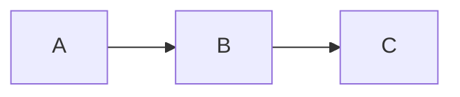
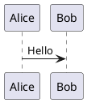

# Rich Editor Phase 1 Implementation Plan

> **For agentic workers:** REQUIRED SUB-SKILL: Use superpowers:subagent-driven-development (recommended) or superpowers:executing-plans to implement this plan task-by-task. Steps use checkbox (`- [ ]`) syntax for tracking.

**Goal:** Upgrade Scribe's note editor with comfortable typography, a fixed formatting toolbar, keyboard shortcuts, and a side-by-side Mermaid/PlantUML diagram preview panel.

**Architecture:** Enhance the existing `NSTextView`-based editor in-place — no new Swift package dependencies. Pure-logic utilities (`InlineMarkerEditor`, `PlantUMLEncoder`, `DiagramRenderer.extractBlocks`) are extracted as internal types so they can be unit-tested via `swift test`. The diagram panel uses `WKWebView` loaded with a locally-bundled `beautiful-mermaid.js`; PlantUML diagrams are fetched from `plantuml.com`.

**Tech Stack:** SwiftUI + AppKit (`NSTextView`, `WKWebView`), XCTest via `swift test`, `beautiful-mermaid` (bundled JS resource), `zlib` (Darwin, for PlantUML raw-deflate encoding), `URLSession` (PlantUML SVG fetch).

---

## File Map

| File | Status | Responsibility |
|---|---|---|
| `Scribe/UI/DesignSystem/MarkdownEditorView.swift` | Modify | Paragraph style in `base()`, dynamic inset via `setFrameSize`, `InlineMarkerEditor` enum, `performKeyEquivalent`, `setHeading`, wire `EditorActions` closures |
| `Scribe/UI/Notes/NoteEditorView.swift` | Modify | Own `EditorActions`, add `FormatToolbar` above editor, remove fixed horizontal padding |
| `Scribe/UI/Notes/NoteDetailView.swift` | Modify | Replace editor row with `HSplitView`, add diagram panel toggle button |
| `Scribe/UI/Notes/FormatToolbar.swift` | **New** | `EditorActions` observable class + `FormatToolbar` SwiftUI view |
| `Scribe/UI/Notes/DiagramPreviewPanel.swift` | **New** | `WKWebView`-backed panel, renders Mermaid (JS) + PlantUML (network), exposes `render(blocks:)` |
| `Scribe/UI/Notes/DiagramRenderer.swift` | **New** | `extractBlocks(from:)` static parser + debounced render orchestration |
| `Scribe/Utilities/PlantUMLEncoder.swift` | **New** | Pure Swift PlantUML text encoding (UTF-8 → raw DEFLATE → custom base64) |
| `Scribe/Resources/beautiful-mermaid.js` | **New** | Bundled `beautiful-mermaid` JS distribution |
| `Scribe/Resources/diagram-renderer.html` | **New** | Local HTML page loaded by `WKWebView`; renders Mermaid via bundled JS |
| `ScribeTests/InlineFormatTests.swift` | **New** | Tests for `InlineMarkerEditor.toggle` and `setHeading` helpers |
| `ScribeTests/PlantUMLEncoderTests.swift` | **New** | Tests for PlantUML encoder output validity |
| `ScribeTests/DiagramRendererTests.swift` | **New** | Tests for `DiagramRenderer.extractBlocks` |

---

## Task 1: Typography & Layout

**Files:**
- Modify: `Scribe/UI/DesignSystem/MarkdownEditorView.swift`
- Modify: `Scribe/UI/Notes/NoteDetailView.swift`

- [ ] **Step 1: Add paragraph style to `MarkdownFormatter.base()`**

Replace the existing `base` function (currently at the bottom of the `MarkdownFormatter` enum):

```swift
private static func base(_ font: NSFont) -> [NSAttributedString.Key: Any] {
    let style = NSMutableParagraphStyle()
    style.lineHeightMultiple = 1.7
    style.paragraphSpacing = 8
    return [
        .font: font,
        .foregroundColor: NSColor.labelColor,
        .paragraphStyle: style
    ]
}
```

- [ ] **Step 2: Update default font size**

In `MarkdownEditorView` struct, change the default font property:

```swift
var font: NSFont = .systemFont(ofSize: 15)
```

- [ ] **Step 3: Add dynamic inset via `setFrameSize` override in `MarkdownNSTextView`**

Add this override inside `final class MarkdownNSTextView`:

```swift
override func setFrameSize(_ newSize: NSSize) {
    super.setFrameSize(newSize)
    let sideInset = max(16, (newSize.width - 640) / 2)
    textContainerInset = NSSize(width: sideInset, height: 12)
}
```

- [ ] **Step 4: Remove the hardcoded `textContainerInset` in `makeNSView`**

In `makeNSView`, remove this line (the dynamic override now handles it):
```swift
tv.textContainerInset = NSSize(width: 4, height: 8)
```

- [ ] **Step 5: Remove fixed horizontal padding from `NoteDetailView`**

In `NoteDetailView.swift`, the `NoteEditorView(...)` call currently has `.padding(.horizontal, DesignTokens.Spacing.xxxl)`. Remove only the horizontal padding — keep the vertical padding:

```swift
// Before:
NoteEditorView(...)
    .padding(.horizontal, DesignTokens.Spacing.xxxl)
    .padding(.vertical, DesignTokens.Spacing.lg)

// After:
NoteEditorView(...)
    .padding(.vertical, DesignTokens.Spacing.lg)
```

- [ ] **Step 6: Build and visually verify**

```bash
cd /Users/kapil/Documents/dev/02_personal/scribe
xcodebuild -scheme Scribe -configuration Debug build 2>&1 | tail -5
```

Open the app. Open any note with multiple paragraphs. Verify: text is larger, has breathing room between lines and paragraphs, content narrows to a readable column as window is widened.

- [ ] **Step 7: Commit**

```bash
git add Scribe/UI/DesignSystem/MarkdownEditorView.swift Scribe/UI/Notes/NoteDetailView.swift
git commit -m "feat(editor): comfortable typography — 15pt, 1.7× line height, 640px max width"
```

---

## Task 2: Inline Marker Toggle (Pure Logic + Tests)

**Files:**
- Modify: `Scribe/UI/DesignSystem/MarkdownEditorView.swift`
- Create: `ScribeTests/InlineFormatTests.swift`

- [ ] **Step 1: Write failing tests**

Create `ScribeTests/InlineFormatTests.swift`:

```swift
import XCTest
@testable import Scribe

final class InlineFormatTests: XCTestCase {

    // MARK: - InlineMarkerEditor.toggle

    func testWrapsSelectionInMarker() {
        let (text, sel) = InlineMarkerEditor.toggle(in: "hello world", selection: NSRange(location: 0, length: 11), marker: "**")
        XCTAssertEqual(text, "**hello world**")
        XCTAssertEqual(sel, NSRange(location: 0, length: 15))
    }

    func testUnwrapsWhenSelectionIncludesMarkers() {
        let (text, sel) = InlineMarkerEditor.toggle(in: "**hello world**", selection: NSRange(location: 0, length: 15), marker: "**")
        XCTAssertEqual(text, "hello world")
        XCTAssertEqual(sel, NSRange(location: 0, length: 11))
    }

    func testUnwrapsWhenSelectionExcludesMarkers() {
        // Selection is just "hello world", markers are outside
        let (text, sel) = InlineMarkerEditor.toggle(in: "**hello world**", selection: NSRange(location: 2, length: 11), marker: "**")
        XCTAssertEqual(text, "hello world")
        XCTAssertEqual(sel, NSRange(location: 0, length: 11))
    }

    func testWrapsWithSingleStarMarker() {
        let (text, sel) = InlineMarkerEditor.toggle(in: "word", selection: NSRange(location: 0, length: 4), marker: "*")
        XCTAssertEqual(text, "*word*")
        XCTAssertEqual(sel, NSRange(location: 0, length: 6))
    }

    func testEmptySelectionInsertsMarkerPair() {
        let (text, sel) = InlineMarkerEditor.toggle(in: "hello", selection: NSRange(location: 3, length: 0), marker: "**")
        XCTAssertEqual(text, "hel****o")
        // Cursor should be between the two markers
        XCTAssertEqual(sel, NSRange(location: 5, length: 0))
    }

    func testWrapsInMiddleOfLargerString() {
        let (text, sel) = InlineMarkerEditor.toggle(in: "before word after", selection: NSRange(location: 7, length: 4), marker: "`")
        XCTAssertEqual(text, "before `word` after")
        XCTAssertEqual(sel, NSRange(location: 7, length: 6))
    }
}
```

- [ ] **Step 2: Run to verify failure**

```bash
cd /Users/kapil/Documents/dev/02_personal/scribe
swift test --filter InlineFormatTests 2>&1 | tail -15
```

Expected: compile error — `InlineMarkerEditor` not found.

- [ ] **Step 3: Implement `InlineMarkerEditor` in `MarkdownEditorView.swift`**

Add this at the bottom of `MarkdownEditorView.swift`, after the `MarkdownFormatter` enum:

```swift
// MARK: - Inline marker toggle (pure function — testable without AppKit)

enum InlineMarkerEditor {

    /// Toggles `marker` around `selection` in `text`.
    /// - If selection has length 0: inserts `markermarker` and positions cursor between them.
    /// - If selection text starts+ends with `marker`: strips them.
    /// - If characters immediately outside selection equal `marker`: strips them (expanding selection).
    /// - Otherwise: wraps selection in `marker`.
    /// Returns `(newText, newSelection)`.
    static func toggle(
        in text: String,
        selection: NSRange,
        marker: String
    ) -> (text: String, selection: NSRange) {
        let ns = text as NSString
        let mlen = marker.utf16.count

        // Empty selection: insert paired markers, cursor between them
        if selection.length == 0 {
            let inserted = marker + marker
            let newText = ns.replacingCharacters(in: selection, with: inserted)
            let cursor = NSRange(location: selection.location + mlen, length: 0)
            return (newText, cursor)
        }

        let selected = ns.substring(with: selection)

        // Case 1: selection includes markers (e.g. user selected "**word**")
        if selected.hasPrefix(marker) && selected.hasSuffix(marker) && selected.utf16.count > mlen * 2 {
            let inner = String(selected.dropFirst(marker.count).dropLast(marker.count))
            let newText = ns.replacingCharacters(in: selection, with: inner)
            return (newText, NSRange(location: selection.location, length: inner.utf16.count))
        }

        // Case 2: markers are outside selection (e.g. selection is "word" inside "**word**")
        let beforeLoc = selection.location - mlen
        let afterLoc = selection.location + selection.length
        if beforeLoc >= 0 && afterLoc + mlen <= ns.length {
            let before = ns.substring(with: NSRange(location: beforeLoc, length: mlen))
            let after  = ns.substring(with: NSRange(location: afterLoc, length: mlen))
            if before == marker && after == marker {
                let expandedRange = NSRange(location: beforeLoc, length: selection.length + mlen * 2)
                let newText = ns.replacingCharacters(in: expandedRange, with: selected)
                return (newText, NSRange(location: beforeLoc, length: selected.utf16.count))
            }
        }

        // Case 3: wrap
        let wrapped = marker + selected + marker
        let newText = ns.replacingCharacters(in: selection, with: wrapped)
        return (newText, NSRange(location: selection.location, length: wrapped.utf16.count))
    }
}
```

- [ ] **Step 4: Run tests to verify they pass**

```bash
swift test --filter InlineFormatTests 2>&1 | tail -15
```

Expected: all 6 tests PASS.

- [ ] **Step 5: Commit**

```bash
git add Scribe/UI/DesignSystem/MarkdownEditorView.swift ScribeTests/InlineFormatTests.swift
git commit -m "feat(editor): add InlineMarkerEditor toggle logic with tests"
```

---

## Task 3: Keyboard Shortcuts

**Files:**
- Modify: `Scribe/UI/DesignSystem/MarkdownEditorView.swift`

- [ ] **Step 1: Add `performKeyEquivalent` to `MarkdownNSTextView`**

Add this method inside `final class MarkdownNSTextView`:

```swift
override func performKeyEquivalent(with event: NSEvent) -> Bool {
    guard event.modifierFlags.intersection(.deviceIndependentFlagsMask) == .command,
          let key = event.charactersIgnoringModifiers else {
        return super.performKeyEquivalent(with: event)
    }

    switch key {
    case "b":
        applyMarker("**")
        return true
    case "i":
        applyMarker("*")
        return true
    case "`":
        applyMarker("`")
        return true
    case "k":
        applyLinkFormat()
        return true
    default:
        return super.performKeyEquivalent(with: event)
    }
}

private func applyMarker(_ marker: String) {
    let sel = selectedRange()
    let (newText, newSel) = InlineMarkerEditor.toggle(in: string, selection: sel, marker: marker)
    guard let storage = textStorage else { return }
    storage.beginEditing()
    storage.replaceCharacters(in: NSRange(location: 0, length: storage.length), with: newText)
    storage.endEditing()
    setSelectedRange(newSel)
    // Re-run markdown highlighting
    (delegate as? NSObject)?.value(forKey: "_scribeApplyFormatting").self
    NotificationCenter.default.post(
        name: NSText.didChangeNotification,
        object: self
    )
}

private func applyLinkFormat() {
    let sel = selectedRange()
    let selectedText = (string as NSString).substring(with: sel)
    let clipboard = NSPasteboard.general.string(forType: .string) ?? ""
    let isURL = URL(string: clipboard)?.scheme?.hasPrefix("http") == true

    let replacement: String
    if isURL {
        replacement = "[\(selectedText.isEmpty ? "link" : selectedText)](\(clipboard))"
    } else {
        replacement = "[["
    }

    guard let storage = textStorage else { return }
    storage.beginEditing()
    storage.replaceCharacters(in: sel, with: replacement)
    storage.endEditing()

    if !isURL {
        // Position cursor inside [[ to trigger wiki-link autocomplete
        setSelectedRange(NSRange(location: sel.location + 2, length: 0))
    }
    NotificationCenter.default.post(name: NSText.didChangeNotification, object: self)
}
```

**Note on formatting refresh:** The `NSText.didChangeNotification` triggers `Coordinator.textDidChange(_:)` which calls `applyFormatting`. This is the correct hook rather than calling the coordinator directly.

- [ ] **Step 2: Build and smoke-test**

```bash
xcodebuild -scheme Scribe -configuration Debug build 2>&1 | tail -5
```

Open the app, type some text, select a word, press ⌘B — it should wrap in `**`. Press ⌘B again — should unwrap.

- [ ] **Step 3: Commit**

```bash
git add Scribe/UI/DesignSystem/MarkdownEditorView.swift
git commit -m "feat(editor): keyboard shortcuts ⌘B/I/\`/K for inline formatting"
```

---

## Task 4: EditorActions + FormatToolbar

**Files:**
- Create: `Scribe/UI/Notes/FormatToolbar.swift`
- Modify: `Scribe/UI/DesignSystem/MarkdownEditorView.swift`
- Modify: `Scribe/UI/Notes/NoteEditorView.swift`

- [ ] **Step 1: Create `FormatToolbar.swift`**

Create `Scribe/UI/Notes/FormatToolbar.swift`:

```swift
// Scribe/UI/Notes/FormatToolbar.swift
import SwiftUI

@Observable
final class EditorActions {
    var bold: (() -> Void)?
    var italic: (() -> Void)?
    var strikethrough: (() -> Void)?
    var code: (() -> Void)?
    var setHeading: ((Int) -> Void)?  // 0 = paragraph, 1–3 = H1–H3
}

struct FormatToolbar: View {
    let actions: EditorActions

    var body: some View {
        HStack(spacing: 2) {
            ToolbarButton(systemImage: "bold", tooltip: "Bold (⌘B)")        { actions.bold?() }
            ToolbarButton(systemImage: "italic", tooltip: "Italic (⌘I)")     { actions.italic?() }
            ToolbarButton(systemImage: "strikethrough", tooltip: "Strikethrough") { actions.strikethrough?() }
            ToolbarButton(systemImage: "chevron.left.forwardslash.chevron.right", tooltip: "Inline Code (⌘`)") { actions.code?() }

            Divider().frame(height: 16).padding(.horizontal, 4)

            Menu {
                Button("Paragraph") { actions.setHeading?(0) }
                Button("Heading 1") { actions.setHeading?(1) }
                Button("Heading 2") { actions.setHeading?(2) }
                Button("Heading 3") { actions.setHeading?(3) }
            } label: {
                Text("¶ T")
                    .font(.caption)
                    .foregroundStyle(.secondary)
                    .frame(width: 36)
            }
            .menuStyle(.borderlessButton)
            .help("Paragraph style")

            Spacer()
        }
        .padding(.horizontal, 8)
        .padding(.vertical, 4)
        .background(.bar)
        .overlay(alignment: .bottom) { Divider() }
    }
}

private struct ToolbarButton: View {
    let systemImage: String
    let tooltip: String
    let action: () -> Void

    var body: some View {
        Button(action: action) {
            Image(systemName: systemImage)
                .frame(width: 28, height: 24)
        }
        .buttonStyle(.plain)
        .help(tooltip)
    }
}
```

- [ ] **Step 2: Add `EditorActions` parameter to `MarkdownEditorView`**

In `MarkdownEditorView` struct, add a property:

```swift
var actions: EditorActions? = nil
```

In `makeNSView`, after setting up the text view, wire the closures. Add at the end of `makeNSView` before `return scrollView`:

```swift
if let actions = actions {
    let coord = context.coordinator
    actions.bold        = { [weak coord] in coord?.applyMarker("**") }
    actions.italic      = { [weak coord] in coord?.applyMarker("*") }
    actions.strikethrough = { [weak coord] in coord?.applyMarker("~~") }
    actions.code        = { [weak coord] in coord?.applyMarker("`") }
    actions.setHeading  = { [weak coord] level in coord?.setHeading(level) }
}
```

- [ ] **Step 3: Move `applyMarker` to `Coordinator` and add `setHeading`**

The keyboard shortcut code in `MarkdownNSTextView` calls `applyMarker` on itself. Refactor: move `applyMarker` to `Coordinator` so both the keyboard path and the toolbar can share it.

In `MarkdownNSTextView.performKeyEquivalent`, change `applyMarker(...)` calls to delegate to coordinator:

```swift
// Replace applyMarker("**") with:
(delegate as? MarkdownEditorView.Coordinator)?.applyMarker("**")
```

Add `applyMarker` and `setHeading` to `Coordinator`:

```swift
func applyMarker(_ marker: String) {
    guard let tv = textView else { return }
    let sel = tv.selectedRange()
    let (newText, newSel) = InlineMarkerEditor.toggle(in: tv.string, selection: sel, marker: marker)
    guard let storage = tv.textStorage else { return }
    storage.beginEditing()
    storage.replaceCharacters(in: NSRange(location: 0, length: storage.length), with: newText)
    storage.endEditing()
    tv.setSelectedRange(newSel)
    parent.text = tv.string
    applyFormatting(to: tv)
}

func setHeading(_ level: Int) {
    guard let tv = textView else { return }
    let nsText = tv.string as NSString
    let cursorLoc = tv.selectedRange().location
    let lineRange = nsText.lineRange(for: NSRange(location: min(cursorLoc, nsText.length), length: 0))
    let line = nsText.substring(with: lineRange)

    // Strip existing heading prefix
    let stripped: String
    if let match = line.range(of: #"^#{1,6} "#, options: .regularExpression) {
        stripped = String(line[match.upperBound...])
    } else {
        stripped = line
    }

    let newLine = level == 0 ? stripped : String(repeating: "#", count: level) + " " + stripped

    guard let storage = tv.textStorage else { return }
    storage.beginEditing()
    storage.replaceCharacters(in: lineRange, with: newLine)
    storage.endEditing()

    let prefixLen = level == 0 ? 0 : level + 1
    let newCursor = min(lineRange.location + prefixLen, (tv.string as NSString).length)
    tv.setSelectedRange(NSRange(location: newCursor, length: 0))
    parent.text = tv.string
    applyFormatting(to: tv)
}
```

Also remove `applyMarker` and `applyLinkFormat` from `MarkdownNSTextView` — they are now in `Coordinator`. The `performKeyEquivalent` override delegates to coordinator:

```swift
override func performKeyEquivalent(with event: NSEvent) -> Bool {
    guard event.modifierFlags.intersection(.deviceIndependentFlagsMask) == .command,
          let key = event.charactersIgnoringModifiers else {
        return super.performKeyEquivalent(with: event)
    }
    let coord = delegate as? MarkdownEditorView.Coordinator
    switch key {
    case "b":  coord?.applyMarker("**"); return true
    case "i":  coord?.applyMarker("*");  return true
    case "`":  coord?.applyMarker("`");  return true
    case "k":  coord?.applyLinkFormat(); return true
    default:   return super.performKeyEquivalent(with: event)
    }
}
```

Move `applyLinkFormat` to `Coordinator` as well:

```swift
func applyLinkFormat() {
    guard let tv = textView else { return }
    let sel = tv.selectedRange()
    let selectedText = (tv.string as NSString).substring(with: sel)
    let clipboard = NSPasteboard.general.string(forType: .string) ?? ""
    let isURL = URL(string: clipboard)?.scheme?.hasPrefix("http") == true

    let replacement = isURL
        ? "[\(selectedText.isEmpty ? "link" : selectedText)](\(clipboard))"
        : "[["

    guard let storage = tv.textStorage else { return }
    storage.beginEditing()
    storage.replaceCharacters(in: sel, with: replacement)
    storage.endEditing()

    if !isURL {
        tv.setSelectedRange(NSRange(location: sel.location + 2, length: 0))
    }
    parent.text = tv.string
    applyFormatting(to: tv)
    if !isURL {
        detectWikiLinkTyping(in: tv)
    }
}
```

- [ ] **Step 4: Add `FormatToolbar` to `NoteEditorView`**

Open `Scribe/UI/Notes/NoteEditorView.swift`. Add the `EditorActions` state and the toolbar:

```swift
struct NoteEditorView: View {

    @Binding var text: String
    var noteStore: NoteStore
    var onNavigate: (String) -> Void

    @State private var wikiQuery: String = ""
    @State private var showPopup: Bool = false
    @State private var suggestions: [Note] = []
    @State private var editorActions = EditorActions()  // ← add this

    var body: some View {
        VStack(spacing: 0) {                            // ← wrap in VStack
            FormatToolbar(actions: editorActions)       // ← add toolbar

            ZStack(alignment: .topLeading) {
                MarkdownEditorView(
                    text: $text,
                    placeholder: "Write your note…",
                    actions: editorActions,             // ← pass actions
                    extraHighlighter: highlightWikiLinks(_:),
                    onWikiLinkTyped: { query in
                        wikiQuery = query
                        if query.isEmpty {
                            showPopup = false
                        } else {
                            showPopup = true
                            Task { await loadSuggestions(query: query) }
                        }
                    },
                    onWikiLinkNavigate: { anchor in onNavigate(anchor) }
                )

                if showPopup && !suggestions.isEmpty {
                    WikiLinkPopup(
                        suggestions: suggestions,
                        onPick: { note in
                            insertCompletion(note: note)
                            showPopup = false
                        },
                        onDismiss: { showPopup = false }
                    )
                    .padding(.top, 8)
                    .padding(.leading, 4)
                    .zIndex(1)
                }
            }
        }
    }

    // ... existing private methods unchanged
}
```

- [ ] **Step 5: Build and smoke-test**

```bash
xcodebuild -scheme Scribe -configuration Debug build 2>&1 | tail -5
```

Open the app. Verify: toolbar appears above editor with B/I/S/code buttons + paragraph menu. Click **B** with text selected — should bold it. Paragraph menu → Heading 1 should prefix current line with `# `.

- [ ] **Step 6: Commit**

```bash
git add Scribe/UI/Notes/FormatToolbar.swift \
        Scribe/UI/DesignSystem/MarkdownEditorView.swift \
        Scribe/UI/Notes/NoteEditorView.swift
git commit -m "feat(editor): format toolbar with Bold/Italic/Strikethrough/Code/Heading"
```

---

## Task 5: PlantUML Encoder

**Files:**
- Create: `Scribe/Utilities/PlantUMLEncoder.swift`
- Create: `ScribeTests/PlantUMLEncoderTests.swift`

- [ ] **Step 1: Write failing tests**

Create `ScribeTests/PlantUMLEncoderTests.swift`:

```swift
import XCTest
@testable import Scribe

final class PlantUMLEncoderTests: XCTestCase {

    func testEncodeReturnsNonNil() {
        let source = "@startuml\nA -> B: hello\n@enduml"
        XCTAssertNotNil(PlantUMLEncoder.encode(source))
    }

    func testEncodedStringUsesValidAlphabet() {
        let source = "@startuml\nA -> B\n@enduml"
        guard let encoded = PlantUMLEncoder.encode(source) else {
            return XCTFail("encode returned nil")
        }
        let validChars = CharacterSet(charactersIn: "0123456789ABCDEFGHIJKLMNOPQRSTUVWXYZabcdefghijklmnopqrstuvwxyz-_")
        XCTAssertTrue(encoded.unicodeScalars.allSatisfy { validChars.contains($0) },
                      "Encoded string contains invalid characters: \(encoded)")
    }

    func testEncodedLengthIsMultipleOfFour() {
        let source = "@startuml\nA -> B: test\n@enduml"
        guard let encoded = PlantUMLEncoder.encode(source) else {
            return XCTFail("encode returned nil")
        }
        XCTAssertEqual(encoded.count % 4, 0, "PlantUML base64 encodes 3 bytes → 4 chars")
    }

    func testEmptyStringEncodesWithoutCrash() {
        XCTAssertNotNil(PlantUMLEncoder.encode(""))
    }

    func testKnownDiagramProducesNonEmptyEncoding() {
        // Regression: ensure a typical diagram produces a non-empty result
        let source = """
        @startuml
        Alice -> Bob: Authentication Request
        Bob --> Alice: Authentication Response
        @enduml
        """
        let encoded = PlantUMLEncoder.encode(source)
        XCTAssertNotNil(encoded)
        XCTAssertGreaterThan(encoded?.count ?? 0, 10)
    }
}
```

- [ ] **Step 2: Run to verify failure**

```bash
swift test --filter PlantUMLEncoderTests 2>&1 | tail -10
```

Expected: compile error — `PlantUMLEncoder` not found.

- [ ] **Step 3: Implement `PlantUMLEncoder.swift`**

Create `Scribe/Utilities/PlantUMLEncoder.swift`:

```swift
// Scribe/Utilities/PlantUMLEncoder.swift
import Foundation
import zlib

/// Encodes PlantUML source for use with the plantuml.com REST API.
/// Algorithm: UTF-8 → raw DEFLATE → PlantUML custom base64.
/// Usage: append result to "https://www.plantuml.com/plantuml/svg/"
enum PlantUMLEncoder {

    private static let alphabet: [Character] =
        Array("0123456789ABCDEFGHIJKLMNOPQRSTUVWXYZabcdefghijklmnopqrstuvwxyz-_")

    static func encode(_ source: String) -> String? {
        guard let utf8 = source.data(using: .utf8),
              let compressed = rawDeflate(utf8) else { return nil }
        return plantBase64(compressed)
    }

    // MARK: - Private

    private static func rawDeflate(_ data: Data) -> Data? {
        var stream = z_stream()
        // windowBits = -15 → raw DEFLATE (no zlib header/trailer)
        let initResult = deflateInit2_(
            &stream, Z_DEFAULT_COMPRESSION, Z_DEFLATED,
            -15, 8, Z_DEFAULT_STRATEGY,
            ZLIB_VERSION, Int32(MemoryLayout<z_stream>.size)
        )
        guard initResult == Z_OK else { return nil }
        defer { deflateEnd(&stream) }

        var output = Data(count: max(data.count * 2, 64))
        let result: Data? = data.withUnsafeBytes { inBuf in
            guard let inPtr = inBuf.baseAddress?.assumingMemoryBound(to: Bytef.self) else { return nil }
            return output.withUnsafeMutableBytes { outBuf in
                guard let outPtr = outBuf.baseAddress?.assumingMemoryBound(to: Bytef.self) else { return nil }
                stream.next_in  = UnsafeMutablePointer(mutating: inPtr)
                stream.avail_in = uInt(data.count)
                stream.next_out = outPtr
                stream.avail_out = uInt(output.count)
                guard deflate(&stream, Z_FINISH) == Z_STREAM_END else { return nil }
                return output.prefix(Int(stream.total_out))
            }
        }
        return result
    }

    private static func plantBase64(_ data: Data) -> String {
        var result = ""
        result.reserveCapacity((data.count / 3 + 1) * 4)
        var i = data.startIndex
        while i < data.endIndex {
            let next1 = data.index(after: i)
            let next2 = next1 < data.endIndex ? data.index(after: next1) : data.endIndex
            let b1 = data[i]
            let b2 = next1 < data.endIndex ? data[next1] : 0
            let b3 = next2 < data.endIndex ? data[next2] : 0
            result.append(alphabet[Int(b1 >> 2)])
            result.append(alphabet[Int(((b1 & 0x3) << 4) | (b2 >> 4))])
            result.append(alphabet[Int(((b2 & 0xF) << 2) | (b3 >> 6))])
            result.append(alphabet[Int(b3 & 0x3F)])
            i = next2 < data.endIndex ? data.index(after: next2) : data.endIndex
        }
        return result
    }
}
```

- [ ] **Step 4: Run tests to verify they pass**

```bash
swift test --filter PlantUMLEncoderTests 2>&1 | tail -10
```

Expected: all 5 tests PASS.

- [ ] **Step 5: Commit**

```bash
git add Scribe/Utilities/PlantUMLEncoder.swift ScribeTests/PlantUMLEncoderTests.swift
git commit -m "feat(editor): PlantUML text encoder — UTF-8 → raw DEFLATE → custom base64"
```

---

## Task 6: Diagram Block Parser

**Files:**
- Create: `Scribe/UI/Notes/DiagramRenderer.swift`
- Create: `ScribeTests/DiagramRendererTests.swift`

- [ ] **Step 1: Write failing tests**

Create `ScribeTests/DiagramRendererTests.swift`:

```swift
import XCTest
@testable import Scribe

final class DiagramRendererTests: XCTestCase {

    func testEmptyBodyReturnsNoBlocks() {
        XCTAssertTrue(DiagramRenderer.extractBlocks(from: "").isEmpty)
    }

    func testPlainTextReturnsNoBlocks() {
        XCTAssertTrue(DiagramRenderer.extractBlocks(from: "Just some text here.").isEmpty)
    }

    func testExtractsSingleMermaidBlock() {
        let body = """
        Some text

        ```mermaid
        graph LR
            A --> B
        ```

        More text
        """
        let blocks = DiagramRenderer.extractBlocks(from: body)
        XCTAssertEqual(blocks.count, 1)
        XCTAssertEqual(blocks[0].type, .mermaid)
        XCTAssertEqual(blocks[0].source, "graph LR\n    A --> B")
    }

    func testExtractsSinglePlantUMLBlock() {
        let body = """
        ```plantuml
        @startuml
        A -> B
        @enduml
        ```
        """
        let blocks = DiagramRenderer.extractBlocks(from: body)
        XCTAssertEqual(blocks.count, 1)
        XCTAssertEqual(blocks[0].type, .plantuml)
        XCTAssertTrue(blocks[0].source.contains("@startuml"))
    }

    func testExtractsMixedBlocksInOrder() {
        let body = """
        ```mermaid
        graph TD
            A --> B
        ```

        Some text between diagrams.

        ```plantuml
        @startuml
        A -> B
        @enduml
        ```
        """
        let blocks = DiagramRenderer.extractBlocks(from: body)
        XCTAssertEqual(blocks.count, 2)
        XCTAssertEqual(blocks[0].type, .mermaid)
        XCTAssertEqual(blocks[1].type, .plantuml)
    }

    func testUnterminatedBlockIsIgnored() {
        let body = """
        ```mermaid
        graph LR
            A --> B
        """
        XCTAssertTrue(DiagramRenderer.extractBlocks(from: body).isEmpty)
    }

    func testSourceIsStrippedOfLeadingAndTrailingNewlines() {
        let body = "```mermaid\n\ngraph LR\n    A --> B\n\n```"
        let blocks = DiagramRenderer.extractBlocks(from: body)
        XCTAssertFalse(blocks[0].source.hasPrefix("\n"))
        XCTAssertFalse(blocks[0].source.hasSuffix("\n"))
    }
}
```

- [ ] **Step 2: Run to verify failure**

```bash
swift test --filter DiagramRendererTests 2>&1 | tail -10
```

Expected: compile error — `DiagramRenderer` not found.

- [ ] **Step 3: Implement `DiagramRenderer.swift`**

Create `Scribe/UI/Notes/DiagramRenderer.swift`:

```swift
// Scribe/UI/Notes/DiagramRenderer.swift
import Foundation
import Combine
import WebKit

enum DiagramType: Equatable {
    case mermaid
    case plantuml
}

struct DiagramBlock: Equatable {
    let type: DiagramType
    let source: String
}

@MainActor
final class DiagramRenderer: ObservableObject {

    @Published var renderedHTML: String = ""

    private var cancellable: AnyCancellable?
    private weak var webView: WKWebView?

    // MARK: - Public

    /// Attach to a note body publisher; renders after 500ms debounce.
    func bind(bodyPublisher: AnyPublisher<String, Never>, webView: WKWebView) {
        self.webView = webView
        cancellable = bodyPublisher
            .debounce(for: .milliseconds(500), scheduler: RunLoop.main)
            .sink { [weak self] text in
                guard let self else { return }
                let blocks = Self.extractBlocks(from: text)
                Task { await self.renderBlocks(blocks) }
            }
    }

    /// Parses fenced ```mermaid and ```plantuml blocks. Pure function — no side effects.
    static func extractBlocks(from body: String) -> [DiagramBlock] {
        guard let regex = try? NSRegularExpression(
            pattern: #"```(mermaid|plantuml)\n([\s\S]*?)```"#
        ) else { return [] }

        var blocks: [DiagramBlock] = []
        let fullRange = NSRange(body.startIndex..., in: body)

        for match in regex.matches(in: body, range: fullRange) {
            guard match.numberOfRanges == 3,
                  let typeRange   = Range(match.range(at: 1), in: body),
                  let sourceRange = Range(match.range(at: 2), in: body) else { continue }

            let typeStr = String(body[typeRange])
            let source  = String(body[sourceRange]).trimmingCharacters(in: .newlines)
            let type: DiagramType = typeStr == "mermaid" ? .mermaid : .plantuml
            blocks.append(DiagramBlock(type: type, source: source))
        }
        return blocks
    }

    // MARK: - Private rendering

    private func renderBlocks(_ blocks: [DiagramBlock]) async {
        guard !blocks.isEmpty else {
            renderedHTML = ""
            return
        }

        var parts: [String] = []
        for block in blocks {
            switch block.type {
            case .mermaid:
                let svg = await renderMermaid(block.source)
                parts.append(svg ?? "<p class='error'>Mermaid render failed</p>")
            case .plantuml:
                let svg = await fetchPlantUMLSVG(block.source)
                parts.append(svg ?? "<p class='error'>PlantUML unavailable (check internet)</p>")
            }
        }

        let html = parts.joined(separator: "\n<hr>\n")
        webView?.evaluateJavaScript("setContent(\(jsonString(html)))") { _, _ in }
        renderedHTML = html
    }

    private func renderMermaid(_ source: String) async -> String? {
        guard let wv = webView else { return nil }
        let escaped = jsonString(source)
        let js = "renderMermaid(\(escaped))"
        return await withCheckedContinuation { continuation in
            wv.evaluateJavaScript(js) { result, _ in
                guard let jsonStr = result as? String,
                      let data = jsonStr.data(using: .utf8),
                      let obj = try? JSONSerialization.jsonObject(with: data) as? [String: Any],
                      let ok = obj["ok"] as? Bool, ok,
                      let svg = obj["svg"] as? String else {
                    continuation.resume(returning: nil)
                    return
                }
                continuation.resume(returning: svg)
            }
        }
    }

    private func fetchPlantUMLSVG(_ source: String) async -> String? {
        guard let encoded = PlantUMLEncoder.encode(source) else { return nil }
        let urlString = "https://www.plantuml.com/plantuml/svg/\(encoded)"
        guard let url = URL(string: urlString) else { return nil }
        do {
            let (data, _) = try await URLSession.shared.data(from: url)
            return String(data: data, encoding: .utf8)
        } catch {
            return nil
        }
    }

    private func jsonString(_ value: String) -> String {
        let escaped = value
            .replacingOccurrences(of: "\\", with: "\\\\")
            .replacingOccurrences(of: "\"", with: "\\\"")
            .replacingOccurrences(of: "\n", with: "\\n")
            .replacingOccurrences(of: "\r", with: "\\r")
        return "\"\(escaped)\""
    }
}
```

- [ ] **Step 4: Run tests to verify they pass**

```bash
swift test --filter DiagramRendererTests 2>&1 | tail -10
```

Expected: all 6 tests PASS.

- [ ] **Step 5: Commit**

```bash
git add Scribe/UI/Notes/DiagramRenderer.swift ScribeTests/DiagramRendererTests.swift
git commit -m "feat(editor): diagram block parser with tests (mermaid + plantuml)"
```

---

## Task 7: Bundle beautiful-mermaid + HTML Template + DiagramPreviewPanel

**Files:**
- Create: `Scribe/Resources/beautiful-mermaid.js`
- Create: `Scribe/Resources/diagram-renderer.html`
- Create: `Scribe/UI/Notes/DiagramPreviewPanel.swift`

- [ ] **Step 1: Download beautiful-mermaid JS bundle**

Check the package for its distribution file:

```bash
# Find the dist entry point
npm pack beautiful-mermaid --dry-run 2>/dev/null | grep "\.js"
# Or inspect directly
npx --yes js-inspect-pkg beautiful-mermaid 2>/dev/null | head -30
```

If npm is unavailable, download from jsDelivr (check the exact filename from https://www.jsdelivr.com/package/npm/beautiful-mermaid first):

```bash
# Replace <dist-filename> with the actual file found in the package dist/
curl -o Scribe/Resources/beautiful-mermaid.js \
  "https://cdn.jsdelivr.net/npm/beautiful-mermaid/dist/beautiful-mermaid.min.js"
```

Verify the file is non-empty and contains JS:
```bash
head -3 Scribe/Resources/beautiful-mermaid.js
wc -c Scribe/Resources/beautiful-mermaid.js
```

- [ ] **Step 2: Discover the `beautiful-mermaid` render API**

```bash
# Check what the package exports
head -50 Scribe/Resources/beautiful-mermaid.js | grep -E "export|render|module"
# Or check the GitHub README
open https://github.com/lukilabs/beautiful-mermaid
```

The API is expected to expose a `render(source, options)` function. It may be exported as:
- `window.BM.render(source, options)` (UMD global)
- `export { render }` (ES module)

Confirm the export name and update Step 3 accordingly.

- [ ] **Step 3: Create `diagram-renderer.html`**

Create `Scribe/Resources/diagram-renderer.html`. Replace `BM.render` with the actual export name confirmed in Step 2:

```html
<!DOCTYPE html>
<html>
<head>
  <meta charset="utf-8">
  <script src="beautiful-mermaid.js"></script>
  <style>
    * { box-sizing: border-box; }
    body {
      margin: 0;
      padding: 16px;
      font-family: system-ui, -apple-system, sans-serif;
      background: transparent;
    }
    .diagram { margin-bottom: 24px; }
    .diagram svg { max-width: 100%; height: auto; display: block; }
    hr { border: none; border-top: 1px solid #e5e5e5; margin: 24px 0; }
    .error {
      color: #c0392b;
      font-size: 12px;
      padding: 8px 12px;
      background: #fdf2f2;
      border-radius: 4px;
      border-left: 3px solid #e74c3c;
    }
    #content { min-height: 100vh; }
  </style>
  <script>
    // Detect system appearance
    const isDark = window.matchMedia('(prefers-color-scheme: dark)').matches;
    const theme = isDark ? 'github-dark' : 'github-light';

    // Render a Mermaid diagram source string, return JSON {ok, svg} or {ok:false, error}.
    // Replace 'BM.render' with the actual export from beautiful-mermaid.js (check Step 2).
    function renderMermaid(source) {
      try {
        const svg = BM.render(source, { theme });
        return JSON.stringify({ ok: true, svg });
      } catch (e) {
        return JSON.stringify({ ok: false, error: e.message });
      }
    }

    // Inject rendered HTML into the page (called from Swift after all diagrams are ready).
    function setContent(html) {
      document.getElementById('content').innerHTML = html;
    }
  </script>
</head>
<body>
  <div id="content">
    <p style="color: #999; font-size: 13px;">Rendering diagrams…</p>
  </div>
</body>
</html>
```

- [ ] **Step 4: Create `DiagramPreviewPanel.swift`**

Create `Scribe/UI/Notes/DiagramPreviewPanel.swift`:

```swift
// Scribe/UI/Notes/DiagramPreviewPanel.swift
import SwiftUI
import WebKit
import Combine

struct DiagramPreviewPanel: NSViewRepresentable {

    /// Publisher of the note body text (from NoteDetailView's binding).
    let bodyPublisher: AnyPublisher<String, Never>

    func makeCoordinator() -> Coordinator { Coordinator() }

    func makeNSView(context: Context) -> WKWebView {
        let config = WKWebViewConfiguration()
        config.preferences.setValue(true, forKey: "allowFileAccessFromFileURLs")

        let wv = WKWebView(frame: .zero, configuration: config)
        wv.navigationDelegate = context.coordinator

        guard
            let resourceDir = Bundle.main.resourceURL,
            let htmlURL = Bundle.main.url(forResource: "diagram-renderer", withExtension: "html")
        else {
            return wv
        }
        wv.loadFileURL(htmlURL, allowingReadAccessTo: resourceDir)
        context.coordinator.webView = wv
        context.coordinator.pendingPublisher = bodyPublisher
        return wv
    }

    func updateNSView(_ wv: WKWebView, context: Context) {
        // Publisher binding handled once in makeNSView / navigationDelegate didFinish.
    }

    // MARK: - Coordinator

    // @MainActor required: DiagramRenderer is @MainActor, and WKNavigationDelegate
    // callbacks arrive on the main thread — explicit annotation satisfies Swift 6 concurrency.
    @MainActor
    final class Coordinator: NSObject, WKNavigationDelegate {
        var webView: WKWebView?
        var pendingPublisher: AnyPublisher<String, Never>?
        private var renderer = DiagramRenderer()

        func webView(_ webView: WKWebView, didFinish navigation: WKNavigation!) {
            guard let publisher = pendingPublisher else { return }
            renderer.bind(bodyPublisher: publisher, webView: webView)
            pendingPublisher = nil
        }
    }
}
```

- [ ] **Step 5: Build and verify**

```bash
xcodebuild -scheme Scribe -configuration Debug build 2>&1 | tail -10
```

Fix any build errors. If `beautiful-mermaid.js` has a different export shape than `BM.render`, update `diagram-renderer.html` accordingly.

- [ ] **Step 6: Commit**

```bash
git add Scribe/Resources/beautiful-mermaid.js \
        Scribe/Resources/diagram-renderer.html \
        Scribe/UI/Notes/DiagramPreviewPanel.swift
git commit -m "feat(editor): diagram preview panel — WKWebView with beautiful-mermaid + PlantUML"
```

---

## Task 8: Wire Diagram Panel into NoteDetailView

**Files:**
- Modify: `Scribe/UI/Notes/NoteDetailView.swift`

- [ ] **Step 1: Add diagram state + body publisher to `NoteDetailView`**

At the top of `NoteDetailView` struct, add two state properties:

```swift
@State private var showDiagramPanel: Bool = false
```

Create a `bodyPublisher` computed property that converts the `vm.note.body` binding into a publisher. Add this inside `NoteDetailView`:

```swift
private var bodyPublisher: AnyPublisher<String, Never> {
    vm.$note
        .map(\.body)
        .removeDuplicates()
        .eraseToAnyPublisher()
}
```

**Note:** `vm` is `@StateObject` of type `NoteDetailViewModel`. That type must expose `$note` as a `@Published` property. Open `NoteDetailViewModel.swift` and verify `note` is `@Published`. If it is, this works. If `vm` is `@Observable`, use `withObservationTracking` instead — check the file before proceeding.

- [ ] **Step 2: Confirm `bodyPublisher` wiring**

`NoteDetailViewModel` uses `ObservableObject` with `@Published var note: Note`, so `vm.$note.map(\.body)` is valid. No changes needed — proceed to Step 3.

- [ ] **Step 3: Replace editor row with conditional `HSplitView`**

In `NoteDetailView.body`, replace the `NoteEditorView(...)` block (currently between `Divider()` and the backlinks section) with:

```swift
// ── Body editor + optional diagram panel ──────────────────────────
HSplitView {
    NoteEditorView(
        text: Binding(
            get: { vm.note.body },
            set: { vm.note.body = $0; vm.markDirty() }
        ),
        noteStore: .shared,
        onNavigate: { anchor in vm.handleWikiLinkNavigate(anchor: anchor) }
    )
    .padding(.vertical, DesignTokens.Spacing.lg)
    // No .padding(.horizontal) — dynamic inset handles centering

    if showDiagramPanel {
        DiagramPreviewPanel(bodyPublisher: bodyPublisher)
            .frame(minWidth: 300)
    }
}
```

- [ ] **Step 4: Add diagram toggle button to the header row**

In the header `VStack`, add a toggle button to the trailing side of the metadata `HStack`. Find the `HStack(spacing: DesignTokens.Spacing.md)` that contains the "Edited …" text and `NotebookPicker`, and add a trailing `Spacer()` + button:

```swift
HStack(spacing: DesignTokens.Spacing.md) {
    HStack(spacing: DesignTokens.Spacing.sm) {
        Image(systemName: "clock")
            .imageScale(.small)
        Text("Edited \(vm.note.updatedAt.formatted(.relative(presentation: .named)))")
    }
    .font(DesignTokens.Typography.eyebrow)
    .foregroundStyle(.tertiary)
    .tracking(0.5)

    if !vm.note.isDailyNote {
        NotebookPicker(selectedNotebookId: Binding(
            get: { vm.note.notebookId },
            set: { newId in
                vm.note.notebookId = newId
                vm.markDirty()
            }
        ))
    }

    Spacer()  // ← add

    // Diagram toggle — only shown when note has diagram blocks
    if !DiagramRenderer.extractBlocks(from: vm.note.body).isEmpty {
        Button {
            withAnimation(.easeInOut(duration: 0.2)) { showDiagramPanel.toggle() }
        } label: {
            Image(systemName: showDiagramPanel ? "rectangle.split.2x1.fill" : "rectangle.split.2x1")
                .imageScale(.small)
                .foregroundStyle(showDiagramPanel ? .accent : .secondary)
        }
        .buttonStyle(.plain)
        .help(showDiagramPanel ? "Hide diagram panel" : "Show diagram panel")
    }
}
```

- [ ] **Step 5: Build and smoke-test end-to-end**

```bash
xcodebuild -scheme Scribe -configuration Debug build 2>&1 | tail -10
```

Open the app. Create a note with this body:
```
# Test Diagrams



Some text.


```

Verify:
1. Diagram toggle button appears in the metadata row.
2. Clicking it opens a panel to the right.
3. The Mermaid diagram renders (offline).
4. The PlantUML diagram renders (needs internet) or shows an error message if offline.
5. Panel hides when toggled again.

- [ ] **Step 6: Run all tests**

```bash
swift test 2>&1 | tail -20
```

Expected: all existing + new tests PASS.

- [ ] **Step 7: Commit**

```bash
git add Scribe/UI/Notes/NoteDetailView.swift
git commit -m "feat(editor): diagram side panel integrated into note detail view"
```

---

## Final

- [ ] **Run full test suite**

```bash
swift test 2>&1 | grep -E "passed|failed|error"
```

- [ ] **Build release**

```bash
xcodebuild -scheme Scribe -configuration Release build 2>&1 | tail -5
```

- [ ] **Invoke `superpowers:finishing-a-development-branch` skill** to decide on merge/PR strategy.
